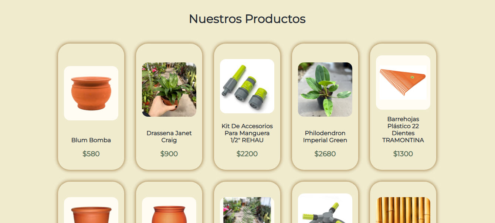
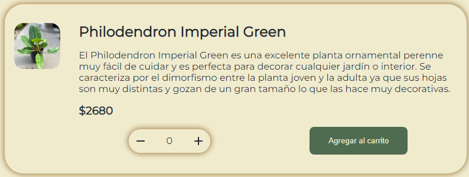
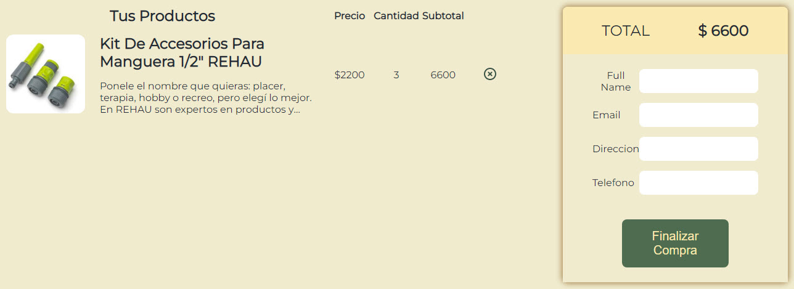
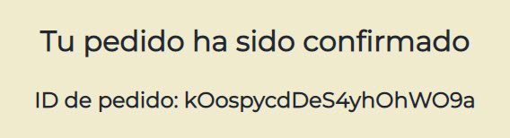
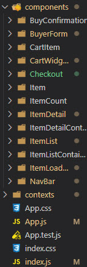
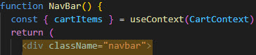
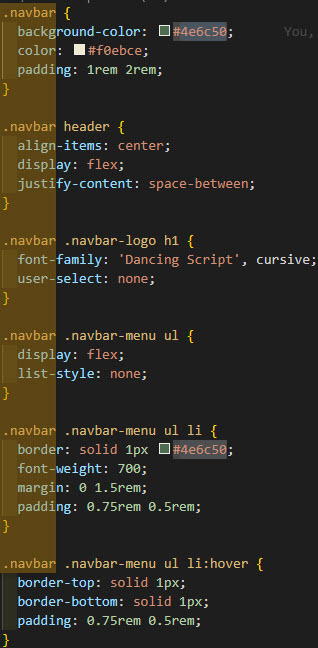

# E-commerce para un vivero

Este proyecto fue creado con [React](https://es.reactjs.org/).

## Cómo utilizar esta página

### **Barra de navegación**

La barra superior sirve para navegar a través de la página, permite mostrar todos los productos de la tienda, o filtrarlos por categorias (plantas, macetas y herramientas). Además, en caso de que haya elementos en el carrito, se incorporará al final de la barra un ícono que muestra la cantidad de elementos agregados al mismo y al hacer click, nos envía a la página de checkout.

### **Lista de productos**

Ya sea que estén filtrados o no, se muestran todos los productos correspondientes, cada uno con su imagen, su título y su precio, y en cada elemento se puede hacer click para agregarlo al carrito.
La lista de productos se obtiene desde una base de datos en Firebase.

### **Detalles de un producto**

Una vez que se hace click en un elemento, se abre una página con los detalles del mismo, aparte de los datos en la lista de productos, se agrega una descripción y controladores para decidir cuántas unidades agregar al carrito y el botón para hacerlo.
También se controla que el ítem no esté ya agregado al carrito y que la cantidad sea mayor a 0 unidades.
### **Carrito**

Aquí se muestra el resumen de compra, las cantidades de cada ítem, su precio y el importe total.
También hay un formulario para rellenar los datos personales y finalizar la compra de todos los productos. Una vez confirmado, se le devolverá al cliente un ID de su pedido para poder realizar consultas sobre el mismo.

___

## Cómo está armada esta página
Al ser codificada utilizando React, para poder armar esta página se hizo uso de componentes.

Cada componente está en una carpeta, donde están el archivo .js y el .css correspondiente para mantener el proyecto más ordenado. Y en cada componente está explicado su funcionamiento en el código. Y para una mejor organización, cada componente tiene como clase al propio nombre del componente. Por ejemplo:

Todos los productos de la tienda son recuperados desde una base de datos creada en firebase, donde también se guardan todas las órdenes de compra una vez que el usuario las confirma.

Además, para la utilización del carrito, se usó el concepto de 'Contexto', codificado en la carpeta 'contexts'. En este contexto se maneja todo lo relacionado al carrito, por ejemplo, ver todos los items agregados, eliminarlos, calcular el total de la compra, etc.
___

## Correr la aplicación

Una vez en el directorio del proyecto, puedes correr:
### `npm start`

Para correr la aplicación en modo desarrollo.\
Abre [http://localhost:3000](http://localhost:3000) para verla en el navegador.
Cada vez que se guarde algún cambio en el código, la página se recarga.

### `npm test`

Lanza las pruebas del sitio.\
Ver la sección [running tests](https://facebook.github.io/create-react-app/docs/running-tests) para más información.

### `npm run build`

Buildea la aplicación a para producción a la carpeta `build`.\
Optimiza el build para el mejor rendimiento.

The build is minified and the filenames include the hashes.\
Your app is ready to be deployed!

Ver la sección [deployment](https://facebook.github.io/create-react-app/docs/deployment) para más información.

### `npm run eject`

**Nota: Esta operación no se puede deshacer.**

Este comando copia todos los archivos de configuración del build al proyecto para que puedas tener completo control sobre ellos. Todos los comandos menos `eject` seguirán funcionando, pero apuntarán a los archivos copiados para que puedas modificarlos.

## Links útiles

Ver más sobre cómo utilizar el comando [Create React App](https://facebook.github.io/create-react-app/docs/getting-started).

Aprender más sobre [React](https://reactjs.org/).